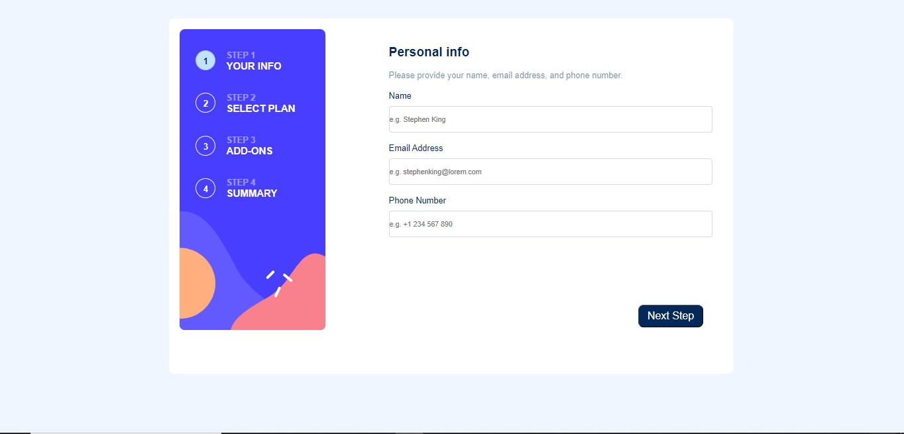

# Frontend Mentor - Multi-step form

This is a solution to the [Multi-step form challenge on Frontend Mentor](https://www.frontendmentor.io/challenges/multistep-form-YVAnSdqQBJ). Frontend Mentor challenges help you improve your coding skills by building realistic projects.

## Table of contents

- [Overview](#overview)
  - [The challenge](#the-challenge)
  - [Screenshot](#screenshot)
  - [Links](#links)
- [My process](#my-process)
  - [Built with](#built-with)
  - [What I learned](#what-i-learned)
  - [Continued development](#continued-development)
  - [Useful resources](#useful-resources)
- [Author](#author)

## Overview

this was fun and hard to do as a beginner

### The challenge

Users are able to:

- Complete each step of the sequence
- Go back to a previous step to update their selections
- See a summary of their selections on the final step and confirm their order
- View the optimal layout for the interface depending on their device's screen size
- See hover and focus states for all interactive elements on the page
- Receive form validation messages if:
  - A field has been missed
  - The email address is not formatted correctly
  - A step is submitted, but no selection has been made

### Screenshot



### Links

- Solution URL: [Add solution URL here](https://your-solution-url.com)
- Live Site URL: [Add live site URL here](https://your-live-site-url.com)

## My process

### Built with

- Semantic HTML5 markup
- CSS custom properties
- Flexbox
- Mobile-first workflow

### What I learned

step indication on forms using JS

```js

function fixStepIndicator(n) {
  var i, step = document.getElementsByClassName("step");
 if (n>=0 && n<4) {
    for (i = 0; i < step.length; i++) {
        step[i].className = step[i].className.replace(" active", "");
      }
      //... and adds the "active" class to the current step:
      step[n].className += " active";
 }
}

```

resposive design with a mobile first approach
  i used 3 @media queries and created a form that accomodates for mobile ,tablet ,laptop and desktop

### Continued development

form validation using js

### Useful resources

- [MDN](https://developer.mozilla.org/en-US/) - This helped me to create a responsive design .

- [W3schools](https://www.w3schools.com) - This is an amazing website helped  understand how to create a multi step form. I'd recommend it to anyone still learning this concept.

## Author

- Website - [Bentry Msuku](https://www.your-site.com)
- Frontend Mentor - [@yourusername](https://www.frontendmentor.io/profile/yourusername)
